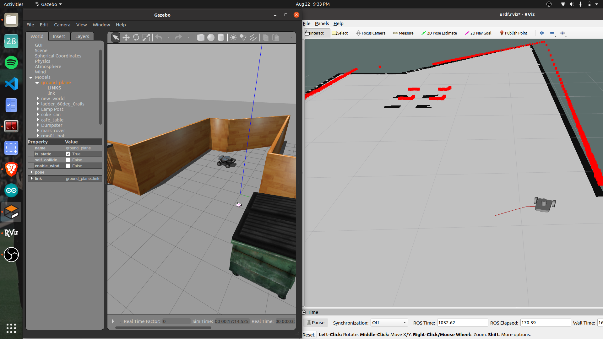

# Path Seeker

## Project Overview

Welcome to the Autonomous Robot Navigation Project repository! This project focuses on creating an autonomous robot capable of precise navigation using the Adaptive Monte Carlo Localization (AMCL) algorithm and a Hokuyo LiDAR sensor for accurate path planning.

The primary goal of this project is to combine cutting-edge robotics technology with intelligent algorithms to achieve seamless autonomous navigation in various environments.

## Key Features

- **AMCL Algorithm**: The Adaptive Monte Carlo Localization (AMCL) algorithm is employed to accurately estimate the robot's position and orientation within a given map, allowing for confident and precise navigation.

- **Hokuyo LiDAR Integration**: The Hokuyo LiDAR sensor is seamlessly integrated into the robot's setup, providing 2D range data that is vital for creating detailed maps and localization.

- **Accurate Localization**: Through the power of AMCL, the robot can determine its location with impressive accuracy, ensuring it navigates without deviations or confusion.

- **Robust Adaptation**: AMCL's ability to handle uncertainties in sensor data and dynamically changing environments equips the robot to navigate through complex scenarios in real-time.

## Project Progress

The project has reached a significant milestone with the successful implementation of the navigation stack using the AMCL algorithm. The robot is now capable of autonomously navigating its environment with accurate localization.

## Getting Started

To explore the code and resources related to this project, please refer to the folders and files in this repository. You will find information on the code structure, sensor integration, algorithms used, and more.

## Contributions

Contributions and suggestions are welcome! If you're interested in improving the project, feel free to fork this repository, make your changes, and submit a pull request.

## Stay Updated

Follow my journey as I continue to refine the navigation stack, explore new environments, and share insights with the robotics community. Connect with me on [LinkedIn](https://www.linkedin.com/in/raghav-nallaperumal-668054203/) and stay tuned for more updates!

## Acknowledgments

I'd like to express my gratitude to the open-source robotics community for their invaluable resources and support.

Feel free to reach out with any questions or ideas. Let's continue to inspire and innovate in the field of robotics!

\#AutonomousNavigation #AMCLAlgorithm #HokuyoLiDAR
